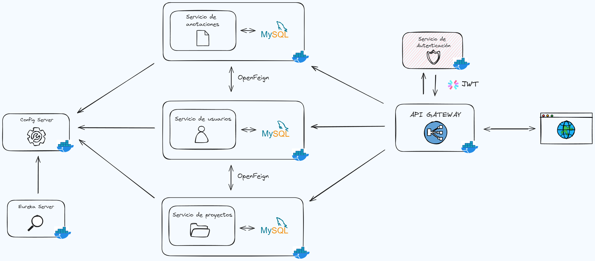

# Proyecto de microservicios de TAD

Este proyecto de microservicios utiliza Docker y Docker Compose para la orquestación y administración de los servicios. Incluye varios microservicios configurados para trabajar juntos en una red de Docker. A continuación se detalla la guía paso a paso para la configuración y ejecución del proyecto.

## Requisitos

- Docker
- Docker Compose

## Construcción de imágenes de Docker

Para construir las imágenes Docker de cada microservicio, navega al directorio de cada microservicio y ejecuta el siguiente comando:

`docker build -t microservices/[nombre-del-microservicio]:latest .
`

## Levantar servicios individuales

Si no deseas levantar todos los servicios a la vez, puedes levantar servicios individuales utilizando el comando docker-compose up seguido del nombre del servicio:

`docker-compose up -d microservice-config`

## Levantar todos los servicios

Para levantar todos los servicios definidos en docker-compose.yml:

`docker-compose up -d
`

## Diagrama de la arquitectura de microservicios

## Rutas

- http://localhost:8100/swagger-ui/index.html <b>(Usuarios)</b>

- http://localhost:8092/swagger-ui/index.html <b>(Proyectos)</b>

- http://localhost:8095/swagger-ui/index.html <b>(Anotaciones)</b>

- http://localhost:8093/swagger-ui/index.html <b>(Autenticación)</b>

- http://localhost:8761 <b>(Eureka Server)</b>

## Docker compose

## Configuraciones

